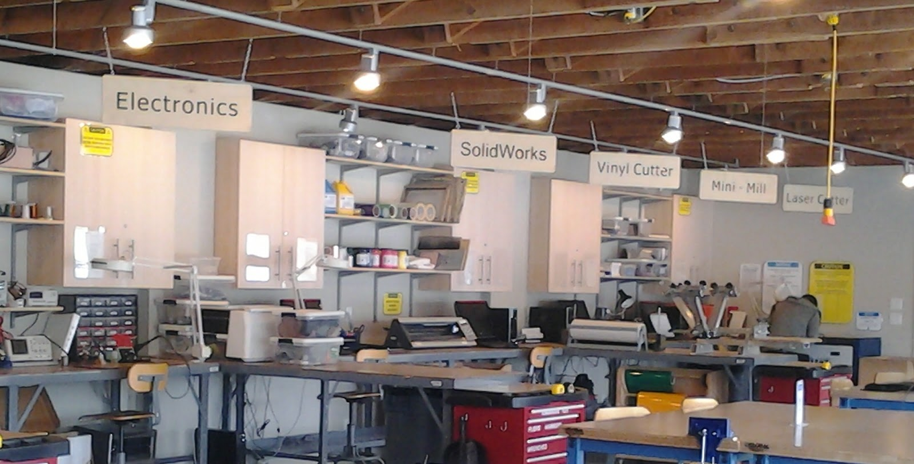

## About me

HELLO WORLD! I am Mohammed Thareeq ,an engineering pursuing bachelor of technology in mechanical engineering at MESCE Kuttipuram,Malapuram.I am from
 Palakkad,Kerala,India.
 
## Contact 
 
 E-mail:thareeqmohammed770@gmail.com
 
 Phone/whatsapp/telegram: +917403427561 
 
 To view my LinkedIn proile [click here]( https://www.linkedin.com/in/mohammed-thareeq-a34884141/)

# FABLAB

Fab Lab is the educational outreach component of MIT’s Center for Bits and Atoms (CBA), an extension of its research into digital fabrication and computation. A Fab Lab is a technical prototyping platform for innovation and invention, providing stimulus for local entrepreneurship. A Fab Lab is also a platform for learning and innovation: a place to play, to create, to learn, to mentor, to invent. To be a Fab Lab means connecting to a global community of learners, educators, technologists, researchers, makers and innovators- -a knowledge sharing network that spans 30 countries and 24 time zones. Because all Fab Labs share common tools and processes, the program is building a global network, a distributed laboratory for research and invention.

A Fab Lab is comprised of off-the-shelf, industrial-grade fabrication and electronics tools, wrapped in open source software and programs written by researchers at MIT’s Center for Bits & Atoms. Currently Fab Labs include a laser cutter that makes 2D and 3D structures, a sign cutter that plots in copper to make antennas and flex circuits, a high-resolution NC milling machine that makes circuit boards and precision parts, a large wood router for building furniture and housing, and a suite of electronic components and programming tools for low-cost, high-speed microcontrollers for on-site rapid circuit prototyping. Originally designed for communities as prototyping platforms for local entrepreneurship, Fab Labs are increasingly being adopted by schools as platforms for project-based, hands-on STEM education. Users learn by designing and creating objects of personal interest or import. Empowered by the experience of making something themselves, they both learn and mentor each other, gaining deep knowledge about the machines, the materials, the design process, and the engineering that goes into invention and innovation. In educational settings, rather than relying on a fixed curriculum, learning happens in an authentic, engaging, personal context, one in which students go through a cycle of imagination, design, prototyping, reflection, and iteration as they find solutions to challenges or bring their ideas to life.                                                                                                                                                                 ## Fablab # Mesce

 The Kerala Startup mission is setting up Fab Labs in the state in collaboration with the Massachusetts Institute of Technology Centre of Bits and Atoms. [Dr Neil Gershenfeld](https://en.wikipedia.org/wiki/Neil_Gershenfeld), director of the MIT Centre for Bits and Atoms pioneered the concept of fab lab.Fab Labs (Fabrication Laboratories) are facilities where people with minimal training can design and manufacture any product using advanced manufacturing machines linked to a computer.turing revolution
At the heart of “FabLab - MESCE” is digital manufacturing technology,
combininig 2D and 3D design with the latest fabrication technology. Embracing
a broad spectrum of methods ranging from CNC machining to 3D printing, and
even PCB Milling. It can produce a single unique product from a digital design
in a matter of minutes- and at a very low cost in comparison to traditional tooling
methods.
“FabLab - MESCE” also hosts a number other technologies and equipments
which provide broad manufacturing capability, including precision laser
. cutters and moulding and milling equipment through electronic
. components and circuit boards.
 
  Fab Lab @ MESCE , Kuttippuram is the only fab lab in the Malabar Zone . A training session was conducted for the students of the college in the month of august 2017 in order to make us familirized with the machines and to help us explore about new technologies . 


Markdown is a lightweight and easy-to-use syntax for styling your writing. It includes conventions for

```markdown
Syntax highlighted code block

# Header 1
## Header 2
### Header 3

- Bulleted
- List

1. Numbered
2. List

**Bold** and _Italic_ and `Code` text

[Link](url) and 
```

For more details see [GitHub Flavored Markdown](https://guides.github.com/features/mastering-markdown/).

### Jekyll Themes

Your Pages site will use the layout and styles from the Jekyll theme you have selected in your [repository settings](https://github.com/thareeqmohammed95/thareeqmohammed95.github.io/settings). The name of this theme is saved in the Jekyll `_config.yml` configuration file.

### Support or Contact

Having trouble with Pages? Check out our [documentation](https://help.github.com/categories/github-pages-basics/) or [contact support](https://github.com/contact) and we’ll help you sort it out.
